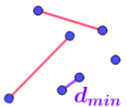
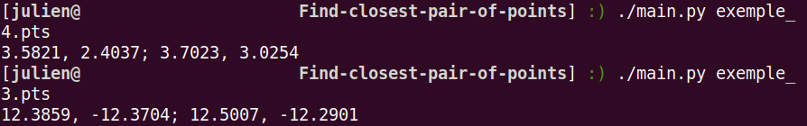

<a name="readme-top"></a>
[](https://github.com/julienbrs)
[![LinkedIn][linkedin-shield]][linkedin-url]

<!-- PROJECT LOGO -->
<br />
<div align="center">
  <a href="https://github.com/julienbrs/Find-closest-pair-of-points">
    
  </a>

<h3 align="center">Find-closest-pair-of-points</h3>
  </p>
</div>

<!-- TABLE OF CONTENTS -->
<summary>Table of Contents</summary>
<ol>
  <li>
    <a href="#about-the-project">About The Project</a>
  </li>
  <li>
    <a href="#getting-started">Getting Started</a>
    <ul>
      <li><a href="#prerequisites">Prerequisites</a></li>
      <li><a href="#installation">Installation</a></li>
    </ul>
  </li>
  <li><a href="#contact">Contact</a></li>
</ol>

<br />


<!-- ABOUT THE PROJECT -->
## About The Project
[](https://www.python.org/)

Consider a set S of n points in the plane. We look for a
pair of distinct points of S of minimal distance. If there are several of them it is enough to display one of them.

<br />




<p align="right">(<a href="#readme-top">back to top</a>)</p>


<!-- GETTING STARTED -->
## Getting Started

To get a local copy up and running follow these simple example steps.

### Prerequisites


* python
  ```sh
  sudo apt install python3
  ```

### Installation

1. Clone the repo
   ```sh
   git clone https://github.com/julienbrs/Find-closest-pair-of-points.git
   ```
3. Go to source folder
   ```sh
   cd src
   ```
3. Rights to execute
   ```sh
   chmod +x main.py
   ```
4. Then run the program on a test file via:
   ```sh
   ./main.py exemple_X.pts
   ```

There are 4 test files available.

It is possible to plot the performance graphs of the algorithms thanks to a result file, by calling the trace_graphe() function in the main.py program 
The file must have the format: time_divide, time_naive, nb_points

<p align="right">(<a href="#readme-top">back to top</a>)</p>


<!-- CONTACT -->
## Contact

Bourseau Julien - *1st year student at Ensimag* - julien.bourseau@gmail.com

Project Link: [https://github.com/julienbrs/Find-closest-pair-of-points](https://github.com/julienbrs/Find-closest-pair-of-points)

<p align="right">(<a href="#readme-top">back to top</a>)</p>


[linkedin-shield]: https://img.shields.io/badge/-LinkedIn-black.svg?style=for-the-badge&logo=linkedin&colorB=555
[linkedin-url]: https://www.linkedin.com/in/julien-bourseau-ba2239228
